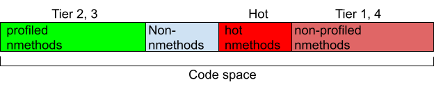
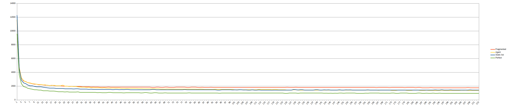

= Hot code Agent results

== Sparse hot code is slower

Some applications may lose their performance due to a huge JVM code cache. It happens when several conditions are met:

1. A lot of code has been JIT-compiled (hundreds of megabytes, gigabytes).
2. There is a vast amount of hot code.
3. The code that is really important (hot) is scattered around the code cache.
4. The CPU has penalties for execution of vast amounts of scattered code.

On systems where this problem is annoying, it can’t be solved by existing easy means like large pages. The slowdown depends on the amount of the hot code, its sparseness and the type of the CPU. Sparseness and amount of the hot code can be measured for applications. Slowdown can be estimated in benchmarks and can be reduced in applications.

== Gathering the hot code

Hot JIT-compiled methods can be densely placed in a special place in the code cache. This place is called a hot code heap. Methods placement can be controlled by extended compiler control directives. That compiler directives can be supplied to the JVM on start or they can be injected into a running JVM.
The proof of concept OpenJDK implementation is available at https://github.com/dchuyko/jdk/tree/hot-methods-segment-02-fragment-agent.

* It is platform independent.
* It extends segmented code cache https://openjdk.org/jeps/197 with a new hot code heap of limited size.
* It contains the refresh extension https://github.com/openjdk/jdk/pull/14111 for the compiler control mechanism https://openjdk.org/jeps/165 and also adds a new ‘Hot’ property for C2 compiler control.
* There is a setting that controls artificial fragmentation of the code heap.
* The hot code agent works with that branch.

Hot hmethods are placed between stubs and non-profiled nmethods to maintain their joint locality:

There are different ways to get a limited list of hot methods that should be selected. For instance:

* Profile running applications.
* Increase compilation thresholds and process compilation logs.
* Write a list of important methods by hand.
* Combine lists.

This agent https://github.com/bell-sw/hotcode-agent/blob/master/README.adoc helps to get a certain count of the hottest methods in the hot code heap. It is able to

* Profile running applications, and make them gather the hot code into the hot code heap.
* Process JFR recordings from other profilers and generate compiler directives for the hot code.

== Benchmarks

Real world applications are hard to test and often they are not public. Known types of problematic/benefiting applications are: monolithic backends, IDEs, sandbox games.
Well known CPU benchmarks do not pollute the code cache. To meet all the problem conditions, it is useful to combine some benchmarks that exhaust code cache to a notable degree with artificial code cache fragmentation. Every jit compiled method not placed in the hot segment can be surrounded by unused memory space. It is also possible to thrash the code cache by generating and calling new code in parallel with the main workload, the result is the same.
Suitable benchmarks are Dotty and Finagle-chirper from Renaissance 0.15.0 https://github.com/renaissance-benchmarks/renaissance/releases/tag/v0.15.0.
During Dotty runs HotSpot occupies up to 98 MB code cache (45 MB non-profiled). It has been profiled with JFR once and generated hot methods list was later used for “Static list” runs on all platforms. When “-XX:EmulateFragmentation=20” is used, the code cache is up to 894 MB. Either static list or the hot code agent can be used to place hot methods in the hot code heap instead of the fragmented space. So the notable Dotty run configurations:

* *Perfect.* `-XX:+PrintCodeCache -XX:ReservedCodeCacheSize=2G -XX:InitialCodeCacheSize=2G -XX:-UseCodeCacheFlushing -XX:+HotCodeHeap -XX:HotCodeHeapSize=128M`
* *Fragmented.* `-XX:+PrintCodeCache -XX:EmulateFragmentation=20 -XX:ReservedCodeCacheSize=2G -XX:InitialCodeCacheSize=2G -XX:-UseCodeCacheFlushing -XX:+HotCodeHeap -XX:HotCodeHeapSize=128M`
* *Static list.* `-XX:+PrintCodeCache -XX:EmulateFragmentation=20 -XX:ReservedCodeCacheSize=2G -XX:InitialCodeCacheSize=2G -XX:-UseCodeCacheFlushing -XX:+HotCodeHeap -XX:HotCodeHeapSize=128M -XX:+UnlockDiagnosticVMOptions -XX:CompilerDirectivesFile=stacks.jfr.directives`
* *Agent.* `-XX:+PrintCodeCache -XX:EmulateFragmentation=20 -XX:ReservedCodeCacheSize=2G -XX:InitialCodeCacheSize=2G -XX:-UseCodeCacheFlushing -XX:+HotCodeHeap -XX:HotCodeHeapSize=128M -javaagent:hotcode-agent-1.0-SNAPSHOT.jar=delay=60s,duration=10s,top=5000,period=15s,interval=10ms`

== The big picture

Over the applications warms up, the code is being profiled and JIT-compiled, then it reaches some stable performance. Times of sequential iterations of the same benchmark can be measured and compared.

Major results:

* Fragmentation penalty can be as high as 87%.
* Both hot code agent and static list cases improve performance of initially fragmented code with comparable results.
* The penalty can sometimes be completely eliminated, sometimes it is only decreased by a significant share.

Other observations:

* Static lists require separate profiling runs. But the profiling can be more detailed.
* The hot code agent adapts to the workload but it takes time.
* First/single agent profiling and processing is the most costly one.
* Periodic profiling with JFR streaming has on overhead that is controlled by profiling frequency.
* Periodic methods refresh can be costly when many methods are updated at once, the overhead is controlled by chunk size.

The overhead related to the agent can be reduced by continuous profiling and hot methods relocation inside the JVM.

== Platform results

Here are degradation numbers for Dotty in configurations described above. It is a stable iteration time increase compared to the “Perfect” case.

[cols="1,1,1,1,1,1,1"]
|===
|CPU |Arch |OS |Fragmented |Agent |Static list |Error

|Graviton 2
|aarch64
|Linux
|38.6%
|11.4%
|16.2%
|0.3%

|Graviton 3
|aarch64
|Linux
|85.6%
|45.7%
|50.2%
|0.5%

|i7-8565U @2GHz
|amd64
|Linux
|2%
|-
|0%
|0.2%

|Power9
|ppc
|Linux
|28%
|14.1%
|6%
|0.7%

|M1
|aarch64
|macOS
|8.7%
|5.4%
|1.2%
|0.5%
|===

Profiling and compact placement of the hot code greatly improved performance on different listed platforms.

